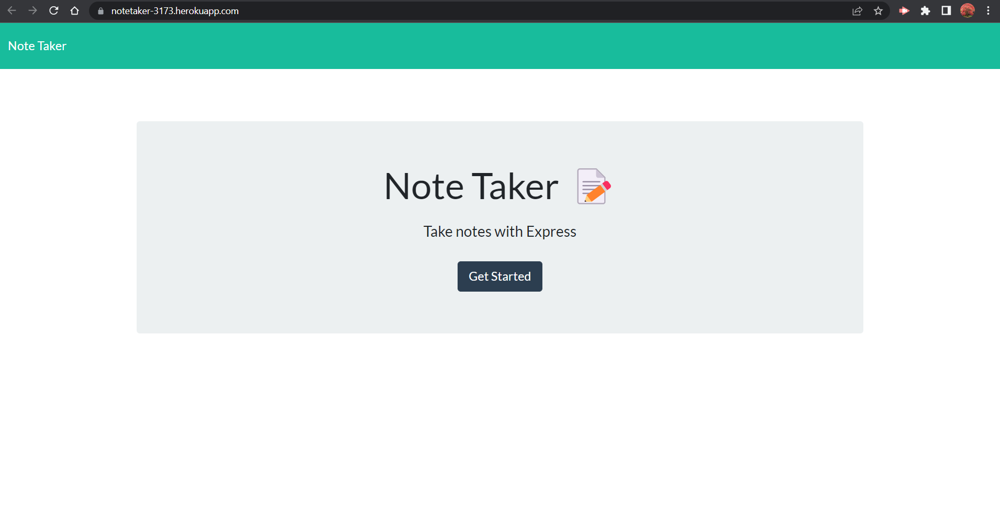
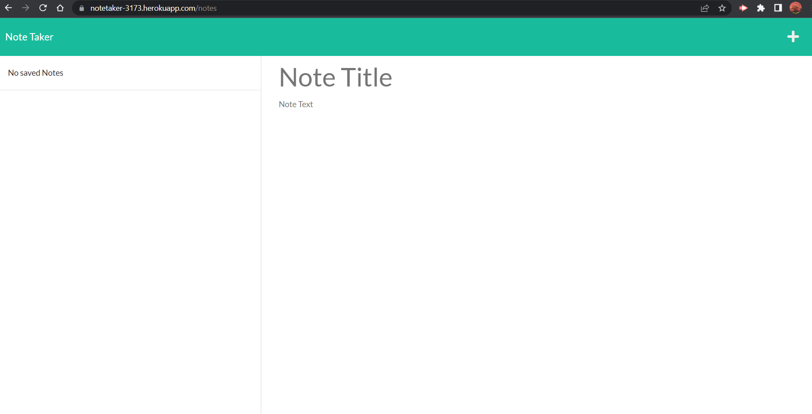
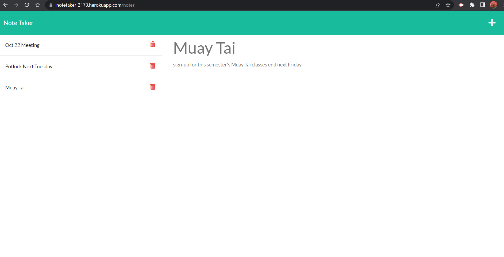

# Note Taker

## Description
The objective of this project was to get a better understanding of Express.js to create endpoints using GET, POST, and DELETE requests.

This app allows the user to enter,save and delete notes.

## Usage
If opening from terminal:
- run `npm install`
- run `npm start` then open link to http://localhost:5000
- or run `heroku open` to launch app on heroku site

## DEMO

## Links
* GitHub: https://kosmonaut3173.github.io/Note-Taker/

* Heroku: https://notetaker-3173.herokuapp.com/